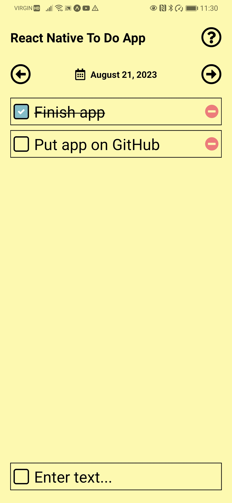

# Description

A React Native implementation of a "To Do" application

# Preview

# Getting Started with Expo

This project was created with [Expo](https://expo.dev/).

## Available Scripts

In the project directory, you can run:

### `npm start`

Runs the app in the development mode.\
Then download Expo Go app for your smart phone: [Expo Go](https://expo.dev/client)
